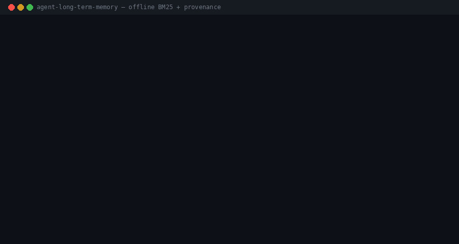

# agent-long-term-memory

**Your agent wakes up with amnesia. Here is a 300-line long-term memory with provenance.**

[](LICENSE)
[](https://www.python.org/)
[](#quickstart)
[](#how-it-works)



A public, stdlib-only Python store that turns local markdown sources into **notes with frontmatter**, ranks them with **BM25**, and compiles a **wiki with backlinks**. No API keys. No `pip install`. No `.env`. The twelve bundled notes are synthetic.

---

## Why

Every agent session starts empty. The model is brilliant and has no idea what you decided last Tuesday.

People paper over that with a bigger context window, or with a vector database that stores a sentence and forgets where it came from. Both fail in the same way: **the next session cannot prove a memory**.

A note you cannot cite is a rumor. This repo treats memory as files you can open: title, tags, body, and a `source` path. Retrieval is a ranking over those files. The wiki is a view, not a second source of truth.

## How it works

```
  sources/*.md                 local markdown only
        │
        ▼
     ingest
  split on headings
        │
        ▼
  notes/*.md
  frontmatter: id, source, title, date, tags
        │
        ├──────────────┐
        ▼              ▼
   BM25 index     compile wiki
   tokenize            │
   score               ▼
        │        wiki/<tag>.md
        ▼        wiki/ent-*.md
     query       wiki/index.md
   top 5 + source     backlinks
```

1. **Ingest** a folder of markdown. Each heading becomes a note. The file path and timestamp go into frontmatter.
2. **Store** notes as plain files. The id is `YYYYMMDD` plus a hash of `(source, title)` plus a slug — deterministic, overwrite-safe.
3. **Retrieve** with BM25 (`k1=1.5`, `b=0.75`) over title + tags + text. Stopwords dropped. Scores are numbers you can print.
4. **Compile** one wiki page per tag and per `[[WikiLink]]`, each listing the notes and their sources. `wiki/index.md` has the counts.

## Quickstart

```bash
python3 brain.py --demo
```

That prints stats, runs a canned query, and writes `wiki/`.

```bash
python3 brain.py --ingest-all
python3 brain.py --query "how do agents remember things"
python3 brain.py --compile
python3 brain.py --stats
```

`--query` works on the twelve seed notes with no ingest step. `--ingest-all` adds more notes from `sources/`.

Python 3.10+ stdlib only (`json` is unused on purpose; `re`, `pathlib`, `collections`, `math`, `datetime`, `argparse`, `hashlib`).

```bash
# optional terminal GIF (needs Pillow, not used by brain.py)
python3 tools/make_demo_gif.py
```

## Why provenance

Retrieval without a source trains the agent to sound sure.

Every note here answers three questions a later session will ask:

- **What** did we believe? — `title` + body
- **When** did we write it? — `date`
- **Where** did it come from? — `source`

The wiki repeats those sources as backlinks. If a fact is wrong you open the original file, you do not argue with an embedding.

## Design notes

**Why BM25 and not embeddings.** This corpus is markdown you wrote, not the open web. Lexical overlap is the common case ("remember", "memory", "agent"). BM25 is deterministic, has zero dependencies, and fails in a way you can read. Embeddings help when the query and the note share no tokens; they also need a model, a key or a weight file, and an index that is not `ls notes/`. That is the roadmap, not the demo.

**Why files and not SQLite.** A note is already a document. Git diffs it. A human edits it. The store is a folder.

**Why a compiled wiki.** Tags and `[[entities]]` are cheap graphs. Compiling them into pages is how you see holes: a tag with one note, a source that nothing links back to.

## Limitations

- **Lexical only.** A query that shares no tokens with the note will miss. That is honest, not a bug.
- **No remote ingest.** `ingest_url` accepts a local path or `file://`. Download first if you want a web page in the store.
- **Tiny YAML.** Frontmatter is `key: value` and `tags: [a, b]`. Nested YAML will not parse.
- **No forgetting policy.** Old notes stay until you delete or retag them. Infinite memory is a junk drawer; the code will not clean it for you.
- **English stopwords.** The tokenizer is a regex and a small English list.

## Roadmap

- Optional embedding backend behind the same `search()` signature
- Supersedes / replaces links between notes
- A golden-query file for CI (`query → expected id`)
- Note decay: hide `stale` tags from the default index
- HTML export of the wiki (still no JS framework)

## License

[MIT](LICENSE) — Copyright (c) 2026 Sergio Lim.
